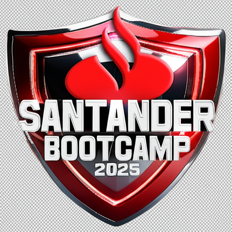

 

<h1> Bootcamp Santander 2025 - Back-End com Python </h1>

 

*Bootcamp* EAD oferecido pelo **Santander**, em parceria com a *Digital Innovation One* (DIO). O objetivo do curso é ensinar desde os conceitos básicos de Python até estruturas avançadas, incluindo manipulação de dados, funções, POO e integração com bancos de dados.

 

**Início**: 09/06/2025 | **Término**: 31/08/2025

**Carga Horária**: 58h

 

## 📝 Atividades
 

**1. Princípios de Desenvolvimento de Aplicações Python**

* Introdução à experiência Santander 2025 ✔️
* Ambiente de desenvolvimento e primeiros passos com Python ✔️
* Conhecendo a linguagem de programação Python ✔️
* Versionamento de código com Git e GitHub ✔️
* Desafios de projetos: crie um portfólio vencedor ✔️
* **Desafio**: Contribuindo em um projeto *Open Source* no GitHub ✔️

 
 

**2. Operadores e Manipulação de String com Python**
* Tipos de operadores com Python ✔️
* Estruturas condicionais e de repetição em Python ✔️
* Manipulando strings com Python ✔️
* **Desafio**: [Criando um sistema bancário com Python](https://github.com/biachristie/dio-bootcamp-backend-com-python/blob/main/Desafios/Desafios_projeto/desafio01_sistema_bancario.py) ✔️
* Desafios de código: aperfeiçoe sua lógica e pensamento computacional ✔️
* **Desafio de código**: explorando operadores e manipulação de strings ✔️

 
 

**3. Estruturas de Dados e Listas com Python**
* Trabalhando com listas em Python ✔️
* Conhecendo tuplas em Python ✔️
* Explorando conjuntos em Python ✔️
* Aprendendo a utilizar dicionários em Python ✔️
* **Desafio de código**: Aplicando estruturas de dados e listas ✔️

 
 

**4. Trabalhando com Funções em Python**
* Dominando funções em Python
* **Desafio**: [Otimizando o sistema bancário com funções Python]()
* **Desafio de código**: Praticando funções em Python

 
 

**5. Orientação a Objetos e Boas Práticas em Python**
* Introdução à programação orientada a objetos (POO) com Python
* Aprendendo o conceito de herança com Python
* Aplicando encapsulamento em Python
* Conhecendo polimorfismo em Python
* Interfaces e classes abstratas com Python
* **Desafio**: [Modelando o sistema bancário em POO com Python]()
* **Desafio de código**: Orientação a objetos e padrões de código

 
 

**6. Trabalhando com Pacotes em Python**
* Decoradores, iteradores e geradores com Python
* Lidando com data, hora e fuso horário no Python
* Manipulando arquivos em Python
* Gerenciamento de pacotes, convenções e boas práticas Python
* **Desafio de código**: Praticando desenvolvimento em Python

 
 

**7. Integração Python com Banco de Dados**
* Introdução a banco de dados
* Introdução a banco de dados relacionais (SQL)
* Introdução ao MongoDB e banco de dados NoSQL ✔️
* Explorando banco de dados relacionais com Python DB API

 
 

**8. Desenvolvimento Orientado a Testes com Python**
* Introdução a aplicações Rest
* **Desafio**: [Desenvolvendo sua primeira API com FastAPI, Python e Docker]()
* **Desafio**: [Criando uma API com FastAPI utilizando TDD]()

 
 

**9. Mentorias**
* *Live* de lançamento: Santander *Bootcamp* 2025 - Iglá Generoso, Regiane Araujo Chaves, Carolina Learth e Angelo Augusto Sartorelli ✔️
* Papo de RH Santander: como destacar suas habilidades e atrair recrutadores - Sabrina Gimenez
* Introdução a metodologias ágeis - Mario Martins
* Como integrar front-end e back-end na prática - Felipe Aguiar
* Ferramentas de copiloto com IA: guia para escrever códigos de maneira eficiente - Aline Antunes
* Primeiros passos com SQL e modelagem de banco de dados = Elidiana Andrade

 
 

## 📍 Conteúdo Extra
 

* Documentação oficial: [Python](https://docs.python.org/3/library/index.html)